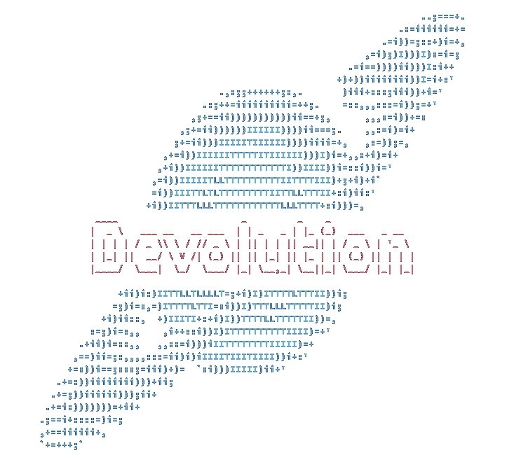

<!-- PROJECT LOGO -->
<br />
<p align="center">
  <a href="https://github.com/markuz449/Devolution-Rust">
  </a>

  
  <h3 align="center">DEVOLUTION</h3>

  <p align="center">
    A choose your own adventure game set in a dystopian future where your decisions not only decide your fate, but the fate of your friends and family.
  </p>
</p>


<!-- TABLE OF CONTENTS -->
## Table of Contents

* [About the Project](#about-the-project)
  * [Built With](#built-with)
* [Getting Started](#getting-started)
  * [Prerequisites](#prerequisites)
  * [Installation](#installation)
* [Usage](#usage)
* [Roadmap](#roadmap)
* [Contributing](#contributing)
* [License](#license)
* [Contact](#contact)
* [Acknowledgements](#acknowledgements)


<!-- ABOUT THE PROJECT -->
## About The Project

Devolution is a sci-fi choose your own adventure game set in a dystopian alien world. This game has been designed for Unix-Terminals so currently it only supports Linux and Mac OS. 

This project is a recreation of a full year project I was apart of that was originally created in C. The stipulations for the project was that it had to be cool and less than 1000 lines of code. I've decided to recreate it in Rust because I wasn't happy with the final release of the original product. 

### Built With

* [Rust](https://www.rust-lang.org/)


<!-- GETTING STARTED -->
## Getting Started

To get a local copy up and running follow these simple steps.

### Prerequisites

* Rust

```sh
curl --proto '=https' --tlsv1.2 -sSf https://sh.rustup.rs | sh
```

### Installation
 
1. Clone the Devolution-Rust
```sh
git clone https://github.com/markuz449/Devolution-Rust.git
```
2. Build using Cargo
```sh
cargo build
```
2. Run using Cargo
```sh
cargo run
```


<!-- USAGE EXAMPLES -->
## Usage

I used the Termion crate in this project to convert the terminal into raw mode. This meant that I could take inputs directly from the user without them having to enter something into the terminal and then press enter to continue the game. Termion also provided text colouring as well as text styling to make the game prettier.

The Character Creator is where you can create your (very simple) character. The current selected segment is blue so you know exactly where you are. The character's name has a max of 20 characters.

<p align="center">
  
</p>

The story is piped through two different unix commands to format the text. I did this so that the story would be more readible as the terminal didn't offer word wrapping. The story was increadibly hard to read when words were broken halfway through with no clear indication. The text formatting also allowed the game to be ran with any size terminal.

<p align="center">
  
</p>

The game also allows the user to re-read back through the story if they forgot something, just like a book. The only choice that is shown was the users original choice, all the other possible choices aren't visible when going back through the story.

<p align="center">
  
</p>

The game also has a super simple help menu! Just hit the 'H' key and then you'll get all the information that you possibly need!
P.S. There isn't a lot...

<p align="center">
  
</p>

You can generate documentation for this project using cargo

1. Generate docs using cargo
```sh
cargo doc
```
2. Navigate to the docs
```sh
cd target/doc/devolution_rust
```
3. Open the documentation
```sh
xdg-open index.html
```

<!-- ROADMAP -->
## Roadmap

See the [open issues](https://github.com/markuz449/Devolution-Rust/issues) for a list of proposed features (and known issues).


<!-- CONTRIBUTING -->
## Contributing

Contributions are what make the open source community such an amazing place to be learn, inspire, and create. Any contributions you make are **greatly appreciated**.

1. Fork the Project
2. Create your Feature Branch (`git checkout -b feature/AmazingFeature`)
3. Commit your Changes (`git commit -m 'Add some AmazingFeature'`)
4. Push to the Branch (`git push origin feature/AmazingFeature`)
5. Open a Pull Request


<!-- LICENSE -->
## License

Distributed under the GNU General Public License v3.0 License. See `LICENSE` for more information.


<!-- CONTACT -->
## Contact

Marcus Anderson - markuz449@gmail.com

Project Link: [https://github.com/markuz449/Devolution-Rust](https://github.com/markuz449/Devolution-Rust)


<!-- ACKNOWLEDGEMENTS -->
## Acknowledgements

* [Rust Docs](https://doc.rust-lang.org/book/ch00-00-introduction.html)
* [Choose an Open Source License](https://choosealicense.com)
* [Termion](https://docs.rs/termion/1.5.6/termion/index.html)
* [Termion Tutorial](http://ticki.github.io/blog/making-terminal-applications-in-rust-with-termion/)
* [Std::fmt Docs](https://doc.rust-lang.org/std/fmt/)
* [Rust Piping](https://www.reddit.com/r/rust/comments/38jhva/piping_string_to_child_process_stdin/)
* [The Grue](https://en.wikipedia.org/wiki/Grue_(monster))